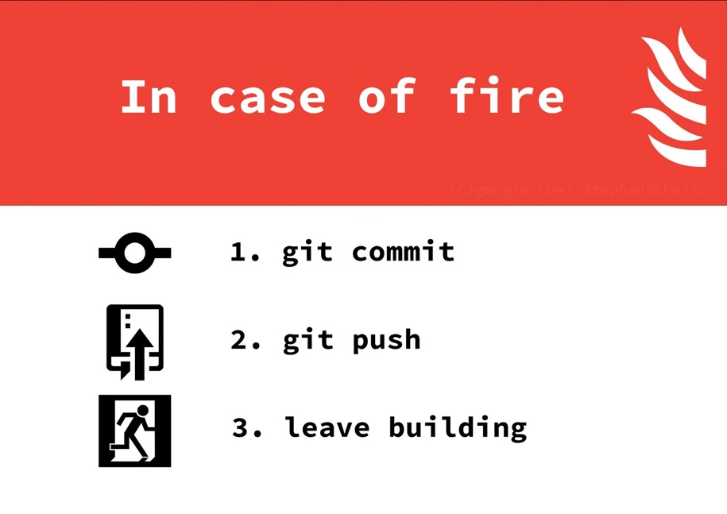
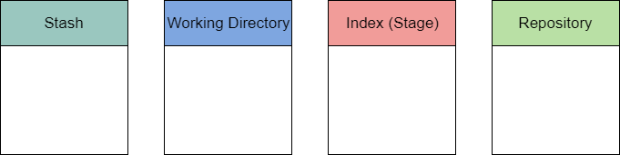

# Git Primer and Workflow

---

### Version Control with Snapshots

- Changes are stored as a snapshot
- Does not track based on file but on snapshot in time
- If file not changed, it is referenced by the snapshot instead of storing it twice

+++

### Locally owned and operated

- Once cloned or initialized, the work you do is local
- To share changes you must push to shared repository

---

### The "areas" of git

- Git is comprised of 4 main areas.
- Stash
- Working Area
- Index (staging area)
- Repository (not shared repository, local)

---

### Stash

- The stash is not used often but it is useful.
- You can store changes you aren't ready to commit and work on something else for a while
- Put your work aside quickly and then get back to it

+++

### Stash commands

- `git stash` - Stores your un-committed data in the stash
- `git stash list` - Shows you your stashes
- `git stash apply` - Brings back the stash to the working directory
- `git stash clear` - Destroys the stash area and removes anything in there

